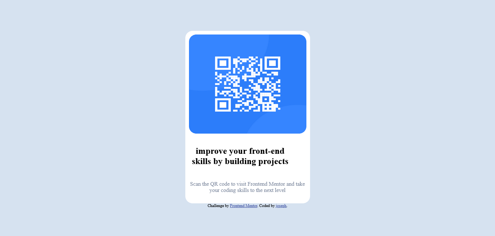

# Frontend Mentor - QR code component solution

This is a solution to the [QR code component challenge on Frontend Mentor](https://www.frontendmentor.io/challenges/qr-code-component-iux_sIO_H). Frontend Mentor challenges help you improve your coding skills by building realistic projects. 

## Table of contents

- [Overview](#overview)
  - [Screenshot](#screenshot)
  - [Links](#links)
- [My process](#my-process)
  - [Built with](#built-with)
  - [What I learned](#what-i-learned)
  - [Continued development](#continued-development)
- [Author](#author)
- [Acknowledgments](#acknowledgments)


## Overview
my first project with frontend mentor building a qr code.

### Screenshot



### Links

- Solution URL: [ coding](https://github.com/joedev-web/mentor_qr_page.git)
- Live Site URL: [site](https://joedev-web.github.io/mentor_qr_page/)

## My process
worked with the initail index page created create a synmatic i can work  with use the div to contain the html when it was structured proceed to using interal css on my html page to style the project to the preview picture i made good use of flexbox css to help center my qr code and used the margin and padding for content sepration all this was done in single page css was on the upper part of the index page html followed after
### Built with

- Semantic HTML5 markup
- CSS custom properties
- Flexbox

### What I learned

i learnt  projects get easier when attempts are made with the right and positve attitude and flex box  is the easiest css display with the aligning nnd jutifying properties 

To see how you can add code snippets, see below:

```html
<h1>Some HTML code I'm proud of</h1>
```
```css
.proud-of-this-css {
  color: papayawhip;
}
```
```js
const proudOfThisFunc = () => {
  console.log('🎉')
}
```

If you want more help with writing markdown, we'd recommend checking out [The Markdown Guide](https://www.markdownguide.org/) to learn more.

### Continued development

on future projects i will work better with css flexbox and learn bootstrap to help create reponsiveness and other designs thta bootstrap brings  in with it easy to use features

## Author

- Frontend Mentor - [profile](https://www.frontendmentor.io/profile/@joedev-web)
- Twitter - [account](https://www.twitter.com/@joseDgeek11)

## Acknowledgments

self learning  front end developer all credits goes too me and to  to  millions of  free resource out there to learn from and frontend mentor for helping me grow.
